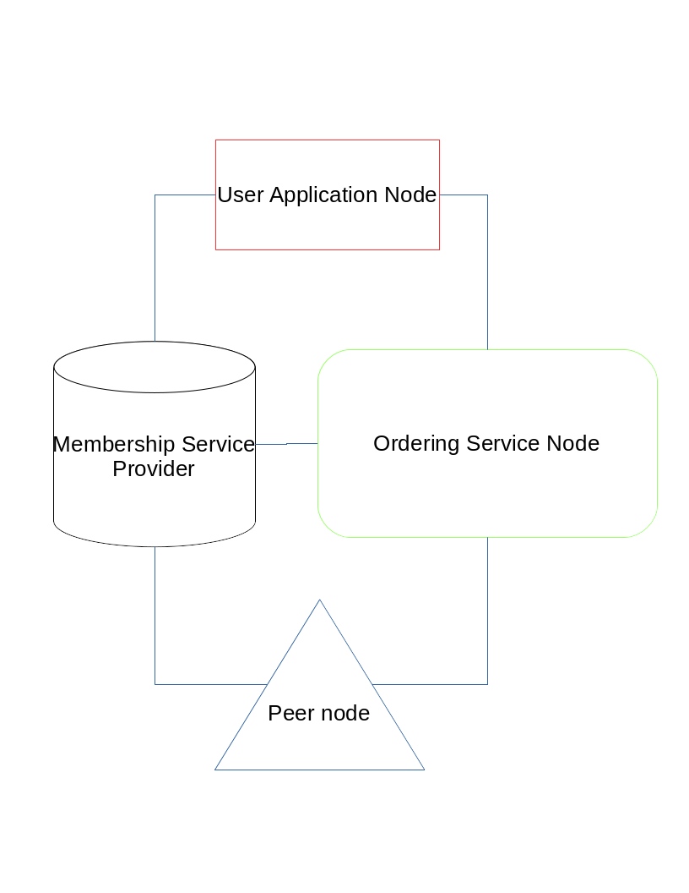

# Abstract

Hyperledger Fabric is a blockchain platform that aims to provide Enterprise grade capabilities, Fabric is unique in its deployment model from other blockchcain platforms; if you are familiar with blockchain, you probably hear all about Bitcoin, and Ethereum (Dapps); or if you come from a financial blockchain background, it's possible you have been introduced to R3 Corda, or Ripple, however; Fabric is uniquely identified from all of these platforms in many ways, whether you are a familiar person with other platforms or a complete beginner; when you complete this exercise you should be familiar with all the concepts in Hyperledger Fabric project.

## Intended Learning Outcomes
* <b> Identify different Hyperledger Fabric project components </b>
* <b> Distinguish the role of Channels, and Smart Contracts (Chaincode) </b>
* <b> Build a Hyperledger Fabric Business Network on Docker </b>
* <b> Build a Hyperledger Fabric Business Network on IBM Blockchain Platform -Optional </b>

# Hyperledger Fabric Introduced

Fabric is one of the Hyperledger umbrella projects, as mentioned earlier; Fabric provides production grade industrial strength blockchain capabilities for enterprise. Fabric aims to serve better buiness experience; whether the business is:
* Business to Customer (B2C)
* Business to Business (B2B)
* Government to Customer (G2C)
* Government to Government (G2G)

This being mentioned, in order to distinguish the area where Fabric exceeds, Fabric provides a solid mechanism of trust, and transperancy that allows all the previous categories to interact with one another freely in ease for higher quality of business. Fabric was built addressing the needs of the enterprise business, hence many of Fabric components might be related to enterprise/organizational concepts. Typical Hyperledger Fabric networks are composed of the following nodes:
* Peer node.
* Ordering service node.
* Membership Service Provider node.
* User application node.

The following figure explains how a typical Hyperledger Fabric network components interact in a given arbitrary setup; the role of each component will be described below.
 

* <b>Membership Service Provider</b>: is the node responsible for managing the membership of different network components, it provides identity credentials which are x509 OpenSSL open standard to be able to interact with different Hyperledger Fabric components; Hyperledger Fabric comes with a particular software component "Fabric-CA" also known as "Fabric Certificate Authority"; which is responsible for issueing x509 credentials to different parties; it's essential component that is concerned with managing your users of the network as well.
* <b>User Application Node</b>: is the node that represents the user interaction; in other words, the client application that the user operates; typical operations that a user might want do is execute a transaction to the blockchain, or query a transaction value from the blockchain; in either case the user application software development kit (SDK) proposes this to the ordering service node, and waits for the confirmation response.
* <b>Peer Node</b>: is the core node that supports the blockchain; the peer node keeps a copy of the whole blockchain blocks i.e. the ledger, and it can also play another crucial role of endorsement; which means, a peer may be also responsible for validating the data committed to the blockchain through the isolated instances in its vicinity that shall be explained later, these instances are: chaincode, and/or database; the chaincode instance is the arbitre that governs how data are committed to the blockchain.
* <b> Ordering Service Node</b>: is the core node that supports the blockchain communication; unlike the peer node, the ordering node makes sure that reliable communication is maintained over the network; it's also responsible for putting the transaction blocks in order in case of multiple user invocations; it's also responsible for broadcasting the blockchain configuration to peer nodes to ensure proper mode of operation.

Now, you should have a proper view of how different Hyperledger Fabric components interact with one another, and what role of every supporting component to the network.

## Pop-Quiz
<b>In a blockchain solution, which type of node exists most in the network? (Node type that exists highest in number)</b>
 
* User Application Node.
* Ordering Service Node.
* Peer Node.

# Hyperledger Fabric Channels, and Smart Contracts (Chaincode)
Now, that we have come to know how a typical Hyperledger Fabric network interacts, one might want to wonder how does an ordering service node put things together in the correct order? Another, pressing question is: Does Hyperledger Fabric mandate committing all data in one place? Because if the answer was yes, then how is that good for business?
 
Luckily, all these questions are answered by one word "Channels"; Hyperledger Fabric network can support multiple blockchain series' / ledgers that are separate from one another that provides the ability to maintain different business contexts on the same business network; inspired by the legacy, there is a separate ledger for each and every business context maintained.
 
* <b> Channels </b>: Hyperledger Fabric considers one ledger as a channel, i.e. all transaction blocks maintained on a channel should be accessible by all Peer Nodes supporting this channel, data committed/queried on a channel is not visible to any Peer Nodes which are not supporting this particular channel.

This allows enterprises to exchange business transactions in a secure discrete manner on a need to know basis, which is very healthy for business; since different parties get different business deals, and apply different rules. Now, speaking of deals, rules, and regulations; the core component supporting the integrity of data on blockchain is "Smart Contract", also known as "Chaincode".
* <b>Smart Contract (Chaincode)</b>: is an isolated instance that runs securely, and only accessible by its peer supporting this chaincode. The smart contract validates the data commited to blockchain during the endorsement process, typically when a transaction is proposed to the ordering service,and broadcast to all peers over a specific channel; the smart contract starts to simulate the execution of this transaction; if it succeeds then the peer votes for this transaction; if it fails then the peer votes against this transaction; and according to the endorsement policy all peers either accept or reject the proposed transaction.
* <b> Endorsement Policies</b>: are a set of semantics that govern whether a transaction block is comitted to the blockchain ledger or not.

## N.B.
<b>Channels, and Endorsement Policies they are not one to one, everychain code has its own endorsement policy; however, chaincode is a running instance while channels, and endorsement policies are only configuration in the network</b>

Now, after the concept of channels, and smart contracts has been introduced; it comes to mind that almost any topology for business networks can be applied; and that's what is going to be covered next.

# Hyperledger Fabric Network Topology
Hyperledger Fabric supports unlimited scope for creating different toplogies, and mostly the network topologies are goverend by business rules, and the non functional requirements to ensure the reliability of service presented. In previous section; we have come to a simple glimpse of the minimal network topology; which consisted of 1 peer, 1 ordering service, 1 membership service provider, and lastly 1 user. However, in this exercise we are going to implement a different topology that is a little bigger than that. The proposed topology will consist of 2 peers where, each is supported by CouchDB, and each belongs to an organization, 1 ordering service, and 1 membership service for all network.
 
Two important notions come to play when constructing a Hyperledger Fabric network:
* <b> Organizations </b>: that's a namespace that defines the scope of the supporting peers to the network. Peers must belong to an organization that defines their role in the network; where these peers are acting on behalf of this organization.
* <b> Consortiums </b>: that's a namespace that governs a set of organizations that are maintaining business with one another; the consortium is the set of organizations that an endorsement policy resolves to.

 
In the lab exercise, you are expected to:

* <b>Investigate the proposed network configurate, and spin up the network.</b>
*  <b> Create a channel, and deploy sample chaincode </b>
* <b> Access the CouchDB through backdoor that maintains the world state </b>
* <b> Create another channel, and deploy another flavor of an encrypted chaincode </b>
* <b> Access the CouchDB through backdoor that maintains the world state.</b>

<b>You should  be provided with a VM that contains all the pre-requirements, and the proper environment setup in order to attempt this exercise. </b>

## Optional deployment option
* <b> Create a business network on IBM Blockchain Platform (IBP) </b>
* <b> Deploy sample chaincode on IBM Blockchain Platform (IBP) </b>

# Deploying Proposed Hyperledger Fabric Network

### Task 1
<b> Under development </b>
### Task 2
<b> Under development </b>

# Deploying sample chaincode to IBM Blockchain Platform

### Task 1
<b> Under development </b>
### Task 2
<b> Under development </b>