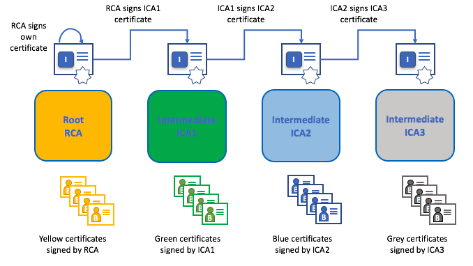
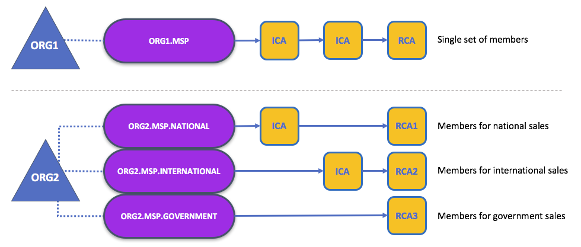
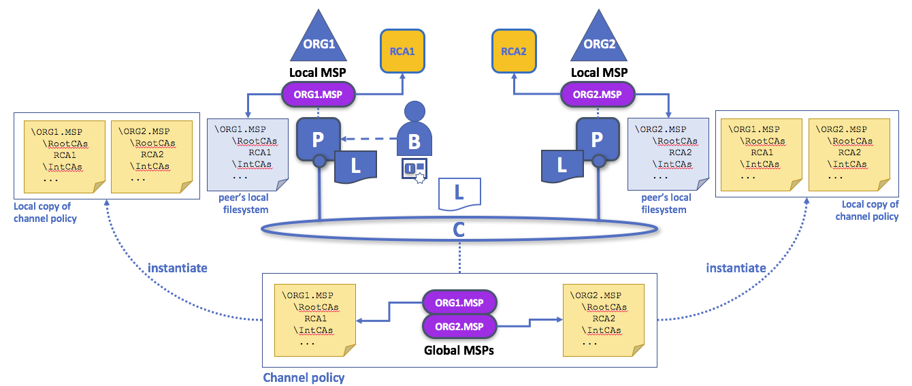
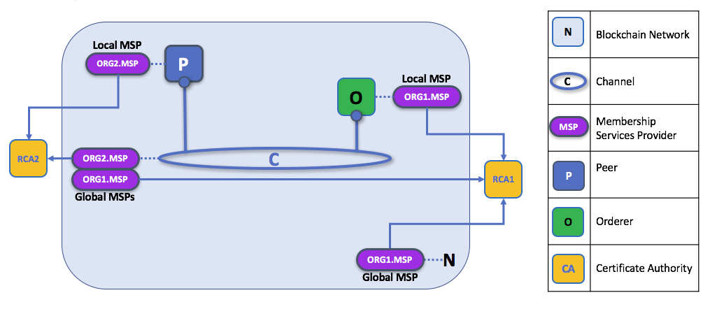
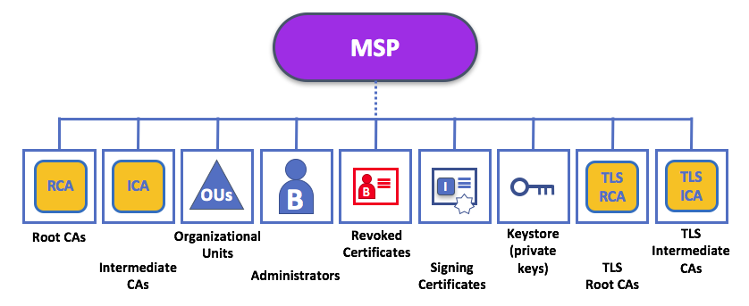

# Fabric Certificate Authority
## Preface
Fabric Certificate Authority (Fabric-CA) is the component in the Hyperledger Fabric platform that’s responsible for issuing enrollment certificates to different parties in the business networks; these certificates are known as (ecerts); the ecerts are subjected to x509 certificate standard. There is basically two types of certificate authorities: Root, and Intermediate. Root certificate authorities represent the core of the chain of trust in the business network; whereas the network is scalable and in most cases it intends to serve massive number of participants it is inevitable to split the load on different components; this also adds more screening to the root server, and prevents its exposure which adds up to the trust in the network.
 

 
Image: Chain of trust
 
Source: Hyperledger Fabric official documentation
 
Intermediate Certificate Authority members are simply assigned by a parent Certificate Authority which doesn’t necessarily need to be a root authority. In case of exposure, only a subset of subscribers are subjected to the exposure which mitigates the risk factor of the compromising threat on the network.
 
## Member Ship Service Provider
Member Ship Service Providers, come into play in order to start identifying the principals of all the verified identities over the network, it also can recognize the related roles of identities on the network; however there are two types of MSPs which are local msps when the service is deployed on a peer node/user application; and global MSP when it’s exposed globally on the network.
Organizations map their members through MSP; because an organization will have a list of its members; and the mapping can be done in various means.
 

 
Image: Membership Service Provider
 
Source: Hyperledger Fabric official documentation
 
The naming convention is using dots to refer to the chaining of organization.membershipprovider.network; and that’s a very convenient form of practice; similar to the domain name industry.
 
Back to local, and global MSPs; Local MSPs are defined for nodes (peer or orderer) and users (administrators that use the CLI or client applications that use the SDK). Every node and user must have a local MSP defined. In contrast, global MSPs are defined either for channels or the entire network, and they apply to all of the nodes that are part of a channel or network. Every channel or network must have at least one MSP defined for it, and peers and orderers on a channel will all share the same global MSP. The key difference here between local and global MSPs is not how they function, but their scope.
 

 
Image: Global & Local Membership Service Providers
 
Source: Hyperledger Fabric official documentation
 
## Member Ship Service Providers Levels
The split between global and local MSPs reflects the needs of organizations to administer their local resources, such as a peer or orderer nodes, and their global resources, such as ledgers, smart contracts, and consortia, which operate at the channel or network level. It's helpful to think of these MSPs as being at different levels, with MSPs at a higher level relating to network administration concerns while MSPs at a lower level handle identity for the administration of private resources.
 
This tiering is helpful because it supports the mix of both broad and narrow administrative control depending on how the network needs to be constituted. MSPs are mandatory at every level of administration -- they must be defined for the network, channel, peer, orderer and users.
 

 
Image: Membership Service Provider levels
 
Source: Hyperledger Fabric official documentation
 
### Network MSP
These MSPs are defined in the configuration policy of the whole network, so by definition, there is only one set of network MSPs. Every principal who uses a network must be a member as defined by the MSPs in the network policy before they can perform an administrative task. This means that the MSPs that are defined for the network should define the organizations who are trusted to have administrative control over the network. An example of a network-wide administrative permission might be to define or change the organizations who can create channels.
 
### Channel MSP
These MSPs are defined inside the configuration policy of each channel, and therefore there is a set of MSPs for each channel that is defined. It is helpful for a channel to have its own set of MSPs because a channel provides private communications between a particular set of organizations which in turn have administrative control over it. You can see that the need for a separate set of channel MSPs stems from the need for local autonomy -- the organizations in a channel can, and will often need to be, largely independent from the rest of the network. It also means that administrative control over the network doesn't necessarily imply control over any particular channel; again reflecting the real administrative needs of collaborating organizations who may sometimes require separation of control. We see this kind of separation at the levels of control in the real world, too. The authority of the President of the United States, for example, exists at the federal level. He or she has no authority to veto state laws.
 
### Peer MSP
This local MSP is defined on the file system of each peer. Conceptually, it performs exactly the same function as global MSPs with the restriction that it only applies to the peer where it is defined. As peers are owned by a particular organization and connect applications from that organization to the ledger, there is only a single MSP for a peer. It's possible to specify multiple different CAs in this MSP, but in practice a local MSP will usually refer to many fewer CAs than a set of global MSPs. An example of a peer permission might be the ability to install or upgrade smart contract chaincode on that peer.
 
### Orderer MSP
Like a peer MSP, an orderer local MSP is also defined on the file system of the node and only applies to that node. Like peer nodes, orderers are also owned by a single organization and therefore have a single MSP to list its trusted principals, though again it's possible to specify multiple Root Cas.
 
## MSP Structure

 
Image: Membership Service Provider Structure
 
Source: Hyperledger Fabric official documentation
 
The two most important elements of an MSP are the identification of the root and intermediate CAs that are used to used to establish a principal's membership of an organization. There are, however, more elements that are used in conjunction with these two to assist with membership functions, there are nine elements to an MSP. It's easiest to think of these elements in a directory structure, where the MSP name is the root folder name with each subfolder representing different elements of an MSP.
 

### Root CA
This folder contains a list of self-signed X.509 certificates of the Root CAs trusted by this organization. There must be at least one Root CA X.509 certificate in this MSP folder. This is the most important folder because it identifies the CAs from which all other certificates must be derived to be considered members of this organization.
 

### Intermediate CA
This folder contains a list of X.509 certificates of the Intermediate CAs trusted by this organization. Each certificate must be signed by one of the Root CAs in the MSP or by an Intermediate CA -- or a chain of ICAs -- that ultimately lead back to a trusted Root CA. It is possible to have a functioning network that does not have any Intermediate CAs, in which case this folder would be empty. However, this is not a best practice. Like the Root CA folder, this folder defines the CAs from which certificates must be issued to be considered members of the organization. It's slightly less important than the Root CA folder, because it's not the root of trusted membership.
 

### Organizational Units
These are listed in the msp/config.yaml and contain a list of organizational units that are considered to be part of the MSP. This is particularly useful when you want to restrict membership to only those principals who are part of a particular organization, as will be the case when an organization has a rich structure.
 

### Adminstrator
This folder contains a list of X.509 certificates that define the principals who have the role of administrators of this organization. Typically there should be one or more certificates in this list.
 

### Revoked Certificates
If the X.509 certificate of a principal has been revoked, identifying information about the cert -- not the cert itself -- is held in this folder. These identifiers -- known as a Subject Key Identifier (SKI) and Authority Access Identifier (AKI) -- are checked whenever a certificate is being used to make sure the certificate is still valid.
 

### Signing Certificates
This folder contains the public X.509 certificate used by a node or user when the need to identify themselves to another principal in the network. This is the certificate a peer places in a transaction proposal response, for example, to indicate that a peer's organization has endorsed it -- which can subsequently be checked against an endorsement policy (containing the organizations that must endorse a transaction) by a validating node.
 

### Private Key Store
This folder is defined for the local MSP of a peer or orderer node (or in a user's local MSP), and contains the private key. This key is used to sign or encrypt data -- for example to sign a transaction proposal response, indicating that a peer's organization has endorsed it.
 

### TLS Root CAs
This folder contains a list of self-signed X.509 certificates of the Root CAs trusted by this organization for TLS communications. An example of a TLS communication would be when a peer needs to connect to an orderer so that it can receive ledger updates.
 

### TLS Intermediate CAs
This folder contains a list of X.509 certificates of the Intermediate CAs trusted by this organization for TLS communications.
 

## Summary
In summary, Hyperledger Fabric uses a PKI and MSPs to identify the principals who are the members of each organization collaborating in a blockchain network. 
 
